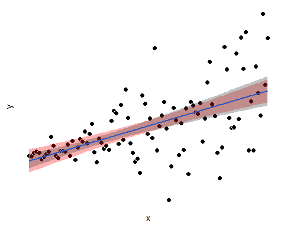

flexibly plotting bootstrapped CIs on scatterplots with ggplot2
================

Today I found a solution to a ggplotting problem that I’ve hit my head
on enough times this past semester to make me sufficiently excited to
write something up and share with whomever might see.

## the problem

As it typically goes, I’ll have two measures, **x** and **y**, and I’d
like to assess their correlation. But these measures don’t seem to be
‘well-behaved’. For example, they might look heteroskedastic:

``` r
library(ggplot2)
set.seed(0)
n <- 100  ## n datapoints
x <- 1:n  ## some measure x
y <- rnorm(x, x, sd = x)  ## some measure y; mean and variance depends on x
p <- ggplot(data.frame(x, y), aes(x, y)) +
  geom_point(fill = "black", color = "white", shape = 21, size = 3) +
  theme(
    axis.ticks = element_blank(),
    axis.text  = element_blank(),
    axis.line  = element_blank(),
    panel.background = element_blank()
  )
p
```


Being aware of the issues that have been raised regarding correlations
and parametric stats (e.g., Wilcox & Rousselet, 2018;
10.1002/cpns.41)—and fooling around on my own with some of these
issues (e.g., see simulation below)—I’ll be wary of trusting the
p-values from parametric tests. For example, the statistic I’d get from
`cor.test(x, y)$p.value` is probably off the mark.

So I use an appropriate test, one that’s robust to heteroskedasticity:
percentile bootstrap of a confidence interval (CI) around the
correlation statistic (see, e.g. Wilcox, Rousselet, & Pernet, 2018;
10.1080/00949655.2018.1501051). For convenience, I wrap this test within
the following function that takes two vectors of the same length, and
spits out a bootstrapped p-value and 95% confidence interval of the
linear correlation coefficient.

``` r
boot.bivar <- function(x, y, n.resamples = 1000) {
  
  if (length(x) != length(y)) stop("x and y not same length")
  
  resample.matrix <- matrix(
    sample.int(length(x), length(x) * n.resamples, replace = TRUE),
    ncol = n.resamples
  )
  resamples <- apply(resample.matrix, 2, function(s) cor(x[s], y[s]))
  
  ## get p-value (alpha = 0.05, 2-tailed):
  prop.less.0 <- mean(resamples < 0)
  p <- 2 * min(prop.less.0, 1 - prop.less.0)
  
  ## get CI (95%):
  lb <- (1 / 20 * n.resamples) / 2
  ub <- n.resamples - lb
  resamples <- sort(resamples)
  
  return(c(p = p, ci95l = resamples[lb], ci95h = resamples[ub]))

}

boot.bivar(x, y)
```

    ##         p     ci95l     ci95h 
    ## 0.0000000 0.4478353 0.6989415

So that’s what I’ll use for inference. Great.

But now, I’d like to depict this uncertainty in my scatterplot.
Specifically, I’d like to overlay this CI as a layer in my plot.
Thinking within the ggplot universe, I first turned to
`geom_smooth()`:

``` r
p + geom_smooth(method = "lm")
```


**BUT.** After thinking for a moment, and looking into `?geom_smooth`, I
realize that `geom_smooth(method = "lm")` uses a parametric estimate of
the CI. It assumes things that aren’t true of the data.

And although I have an appropriately calculated CI already in hand (from
`boot.bivar()`), I also realize that `geom_smooth()` won’t take as input
a ‘user-defined’ CI. So, my question has been: **how do I add a custom
CI layer (e.g., from a bootstrapped CI) to a scatterplot in ggplot2?**

## a solution

Essentially the solution that I found was to use `predict.lm()` (and
`sapply()`) to generate a bootstrapped CI around each predicted value,
\(\mathbf{\hat{y}} \sim \mathbf{x}\beta\), then to feed these values
into `geom_ribbon()`, which draws the thing. And to make this
extensible, I wrapped this bootstrapping part within a function
`boot.bivar.predict()`, which is similar to the one above.

``` r
# function for getting confidence interval:
boot.bivar.predict <- function(
  .data, xname, yname, n.resamples = 1000, percent = 95) {
  
  .formula <- paste0(yname, " ~ ", xname)
  predictions <- sapply(
    seq_len(n.resamples),
    function(.)
      predict(
        lm(.formula, .data[sample.int(nrow(.data), replace = TRUE), ]),
        .data[xname],
      )
  )
  .alpha <- (100 - percent) / 100  ## convert to alpha level
  
  data.frame(
    ub = apply(predictions, 1, quantile, 1 - .alpha / 2),  ## 2-tailed
    lb = apply(predictions, 1, quantile, 0 + .alpha / 2)
  )
  
}
```

I then use it like
this:

``` r
xy.ci <- boot.bivar.predict(data.frame(x, y), "x", "y")  ## get prediction interval
p + geom_ribbon(ymin = xy.ci$lb, ymax = xy.ci$ub, alpha = 0.3)  ## add to plot
```


## a more useful solution

**But, for a more useful solution, I added an additional step of
embedding these two functions—bootstrapping and drawing via
`geom_ribbon()`—within a ggplot2-style function, `stat_boot_ci()`.**
This additional step enables me to call `stat_boot_ci()` as if it were
an out-of-the-box ggplot function, within a ggplot pipe: it inherits
(e.g., I don’t have to explicitly feed it `data`, `x`, or `y` args), and
it takes arguments that `geom_ribbon()` would take (e.g., `alpha`).

To do this, I created `ggproto()` and `layer()` objects, embedded my
bootstrapping function within, and set appropriate defaults.

``` r
## embed function within ggplot framework:
BootCI <- ggproto(
  "BootCI", Stat,
  required_aes = c("x", "y"),

  compute_group = function(data, scales, params, n = 1000, percent = 95) {
    grid <- data.frame(x = data$x)

   predictions <- sapply(
      seq_len(n),
      function(.)
        predict(
          lm(y ~ x, data[sample.int(nrow(data), replace = TRUE), ]),
          grid,
        )
    )

    .alpha <- (100 - percent) / 200  ## 2 tailed
    grid$ymax <- apply(predictions, 1, quantile, 1 - .alpha)
    grid$ymin <- apply(predictions, 1, quantile, .alpha)

    grid

  }
)

stat_boot_ci <- function(mapping = NULL, data = NULL, geom = "ribbon",
                    position = "identity", na.rm = FALSE, show.legend = NA,
                    inherit.aes = TRUE, n = 1000, percent = 95, ...) {
  ## see: https://cran.r-project.org/web/packages/ggplot2/vignettes/extending-ggplot2.html
  layer(
    stat = BootCI, data = data, mapping = mapping, geom = geom,
    position = position, show.legend = show.legend, inherit.aes = inherit.aes,
    params = list(n = n, percent = percent, na.rm = na.rm, ...)
  )
}
```

The page
<https://cran.r-project.org/web/packages/ggplot2/vignettes/extending-ggplot2.html>
was an immense help to this end, and more generally, was a pretty
illuminating walk-through about the guts of ggplot2.

To see our `stat_boot_ci()` function in its glory, I use it below, on
our highly heteroskedastic data. I compare the bootstrapped CI to a
parametric one from `geom_smooth()`; the `geom_smooth()` is displayed
underneath, in red.

``` r
p +
  geom_smooth(method = "lm", se = TRUE, fill = "red", alpha = 1) +
  stat_boot_ci(alpha = 0.3, n = 1E4, percent = 95)
```


Notice how the parametric CI underpredicts the variance when x is high,
and overpredicts when x is
low.

## a simulation: correlation coefficient p-values derived from normality assumption are biased under heteroskedasticity

Here, I convince myself that heteroskedasticity can be a problem for
parametric stats of correlations.

First I created three uncorrelated variables: `x`, `het`, and `hom`. As
you might guess `het` is heteroskedastic with x; `hom` is not. I did
this many times, and recorded the p-values of `x ~ het` and `x ~ hom`
derived from both the t-distribution (`cor.test()`) and our bootstrapped
distribution (`boot.bivar()`).

``` r
n.sims <- 1000
p <- data.frame(
  het.param = vector("numeric", length = n.sims),
  hom.param = vector("numeric", length = n.sims),
  het.boot  = vector("numeric", length = n.sims),
  hom.boot  = vector("numeric", length = n.sims)
)
for (ii in seq_len(n.sims)) {
  het <- rnorm(n, sd = x) ## generate variable that is heteroskedastic and uncorrelated with x
  hom <- rnorm(n, sd = mean(x))  ## generate variable z which is homoskedastic and uncorrelated with x
  p[ii, c("het.param", "hom.param")] <- c(cor.test(x, het)$p.value, cor.test(x, hom)$p.value)
  p[ii, c("het.boot", "hom.boot")] <- c(boot.bivar(x, het)["p"], boot.bivar(x, hom)["p"])
}
```

A look at one draw from the simulation:

``` r
par(mfrow = c(1, 2), mar = c(2, 2, 2, 2))
plot(x, het, main = "x ~ het")
plot(x, hom, main = "x ~ hom")
```


``` r
cor(x, het)
```

    ## [1] 0.03819661

``` r
cor(x, hom)
```

    ## [1] 0.01270133

Because there is no true correlation between `x` and either `het` or
`hom`, the false positive rate should be \~ 5%, if alpha is 0.05. We see
that heteroskedasticity inflates the parametric p-value, but not the
bootstrapped:

``` r
colMeans(apply(p, 2, function(x) x < 0.05)) * 100  ## false positive rate for each statistic
```

    ## het.param hom.param  het.boot  hom.boot 
    ##       6.8       5.0       5.3       5.5

``` r
par(mfrow = c(2, 2), mar = c(2, 2, 2, 2))
hist(p$het.param, main = "heteroskedastic, parametric")
hist(p$hom.param, main = "homoskedastic, parametric")
hist(p$het.boot, main = "heteroskedastic, bootstrapped")
hist(p$hom.boot, main = "homoskedastic, bootstrapped")
```


Another thing becomes apparent, as well, which is that the bootstrapped
p-value might generally be a little optimistic. Even for the `x ~ hom`
correlation, the false-positive rates are **slightly** higher in
bootstrap versus parametric. I’m not sure whether this is a general
property of bootstrap, or due to the specifics of my simulation here.
But I’ll keep it in mind. The important thing, though, is that it’s
clear that bootstrapping a CI is an effective way of side-stepping
heteroskedasticity issues.
