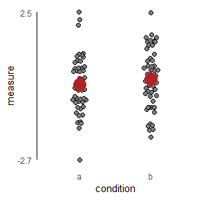
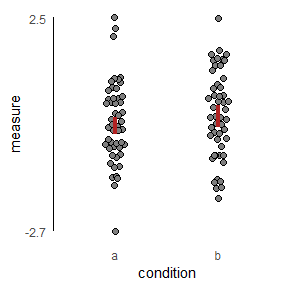

stat\_summary() for on-the-fly summary stats
================

### the problem

You want to quickly make a summary plot of a few measures, using some
measure of central tendency and dispersion. E.g., you want to get the
mean and 95% CI of all subject’s scores in condition a and b of an
experiment, stored in the data.frame `dat`. So you calculate the mean
and 95% CI, save them in a new dataframe, and enter these values as an
additional layer of a ggplot that you build. This is annoying.

### a solution

But this is all unnecessary: stat\_summary() is a ggplot function that
lets you calculate and add summary statistics to plots ‘on the fly’.

#### note:

I’ve found the tidyverse help page for stat\_summary
(<https://ggplot2.tidyverse.org/reference/stat_summary.html>) to be less
than helpful. I had to do some digging to understand how to control some
parts of the `stat_summary()` function. I outline what i learned here.

``` r
library(magrittr)
library(ggplot2)
library(ggbeeswarm)

## make data ----

n.subj <- 50
n.cond <- 2
dat <- data.frame(
  subj      = rep(1:n.subj, n.cond), 
  measure   = rnorm(n.subj * n.cond), 
  condition = letters[1:n.cond]
  )  ## a dataframe of unaggregated (i.e., subject-level) data
```

The below plot, for example, takes the subject-level data in `dat`,
plots them, and overlays mean and CIs. These mean and CIs are bootstrap
estimates from 10,000 resamples.

``` r
n.resamples <- 1E4

## make our basic plot:
p <- dat %>%
  ggplot(aes(x = condition, y = measure)) +
  geom_quasirandom(width = 0.1, color = "black", fill = "grey50", shape = 21, size = 2) +
  theme(
      axis.ticks = element_blank(),
      panel.background = element_blank(),
      axis.line = element_blank()
    ) +
  geom_segment(aes(y = min(measure), yend = max(measure), x = -Inf, xend = -Inf)) +
  scale_y_continuous(breaks = c(round(min(dat$measure), 2), round(max(dat$measure), 2)))

## add mean and errorbars:
p + stat_summary(
    fun.data = "mean_cl_boot", colour = "firebrick", size = 1.5,
    fun.args = list(B = n.resamples)
  )
```

<!-- -->

For just error bars, you can do:

``` r
p + stat_summary(
    fun.data = "mean_cl_boot", colour = "firebrick", size = 1.5, width = 0, geom = "errorbar",
    fun.args = list(B = n.resamples)
  )
```

<!-- -->

Above, the stat\_summary() argument `fun.data = "mean_cl_boot"`, calls
the workhorse function `Hmisc::smean.cl.boot()`, which actually conducts
the bootstrap. (Note that confusingly, it’s called not with the function
name `"smean.cl.boot"`, but with `"mean_cl_boot"`, because hadley fkn
loves underscores i guess.) Note also, we can pass arguments to
`smean.cl.boot()` via the `fun.args` argument. The arguments we pass
must be wrapped within a list. That’s how I changed the number of
iterations. (See `?Hmisc::smean.cl.boot()` for other arguments you could
pass.)

In fact, you could specify any arbitrary function to `stat_summary()`,
so long as it takes a numeric vector as an input and returns a
data.frame with variables `ymin`, `y`, and `ymax`. (See `fun.data`
argument description at `stat_summary()` reference page above.) This
feature i’ve found useful when there’s a repeated summary computation
that should be done for eg, all plots in an analysis, and that there
isn’t a nice and tidy function for computing. For example, the
function I define below, a wrapper for `smean.cl.boot()`, looks in y for
extreme values and removes them prior to calculating the mean and CI.

``` r
afun <- function(y, a = 2, ...) {
  is.extreme <- abs(y - median(y)) > mad(y) * a
  output <- Hmisc::smean.cl.boot(y[!is.extreme], ...)  ## ellipsis to pass additional args from stat_summary
  output <- as.data.frame(t(output))  ## make dataframe
  names(output) <- c("y", "ymin", "ymax")  ## rename
  return(output)
}

p + stat_summary(
    fun.data = "afun", colour = "firebrick", size = 1.5, width = 0, geom = "errorbar",
    fun.args = list(B = n.resamples)
  )
```

<!-- -->

Note that it would probably be misleading to plot summary stats for a
reduced set of data over a full set of data; for the sake of the
example, though, my point is that stats\_summary() is a relatively
flexible function, and useful whenever I’m looking to get some means,
error estimates, etc, quickly onto the page.
